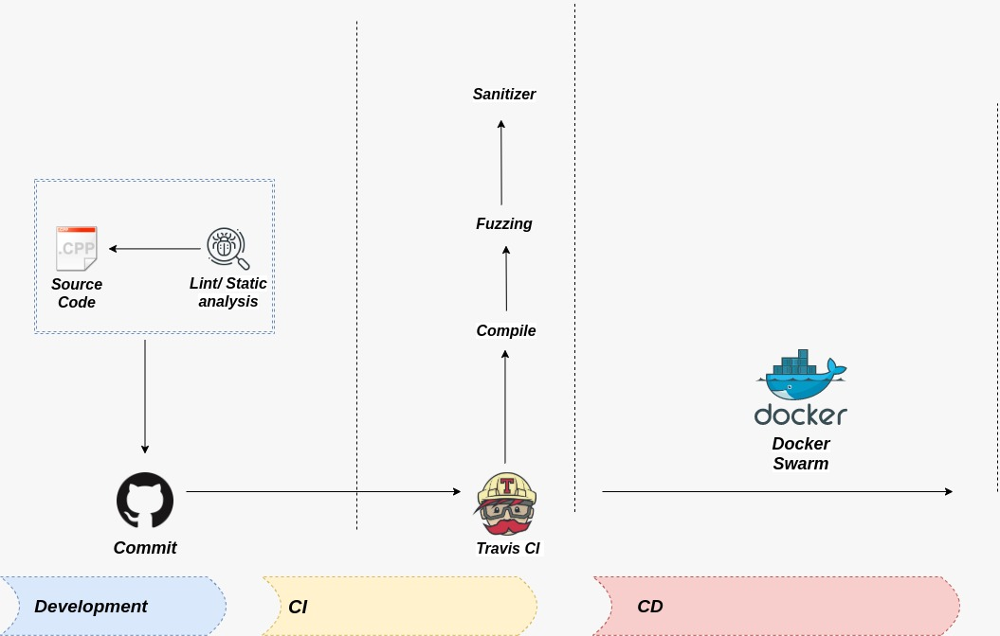

# cpp-Basicpipe
A Very Basic C++ Pipeline

Ideia/ Concept:

<b>PURPOSE:</b>

    - Integrate more security into your existing development environment;
    - This Pipeline in Travis CI will automatically compile and check your executable using Sanitizers and Fuzz Testing

<b>TESTS</b>

    - AddressSanitizer: Checks for memory Address that you access that are out of bounds;
    - ThreadSanitizer: Which can detect if you have a Multi-Threaded program that is doing unsafe thread Things at Runtime;
    - MemorySanitizer: Which does checks if you are accessing uninitializes memory;
    - UndefinedBehaviorSanitizer: Which attempts to look things that you're doing that are invking undefined behavior as far as the C++ Standard goes;
    - DataFlow: Can analyse the data through your program. In this case you have to call the instrumentation (Something that doesn't apply to the others above);
    - LeakSanitizer: Will try to look for Memory Leaks;

<b>The test output will be printed in a separate file!</b>

<b>WARNING:</b>

        - This project/ files are only for DEMONSTRATION purpose!! 
        - This is a work in progress!!